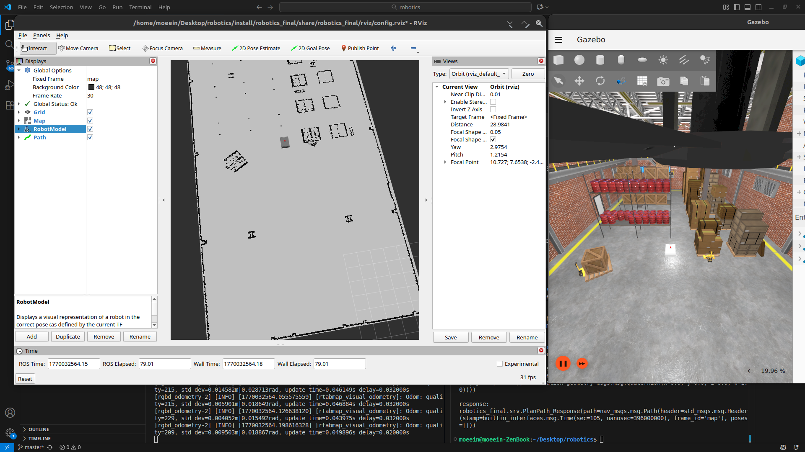
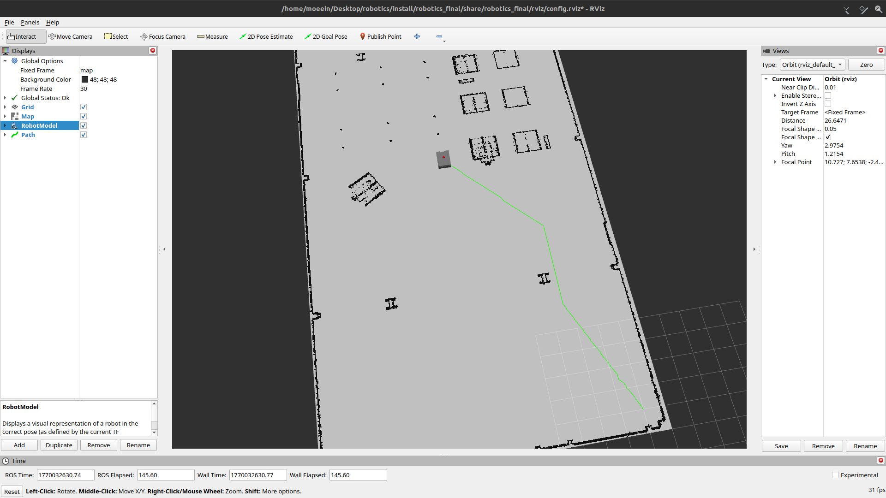
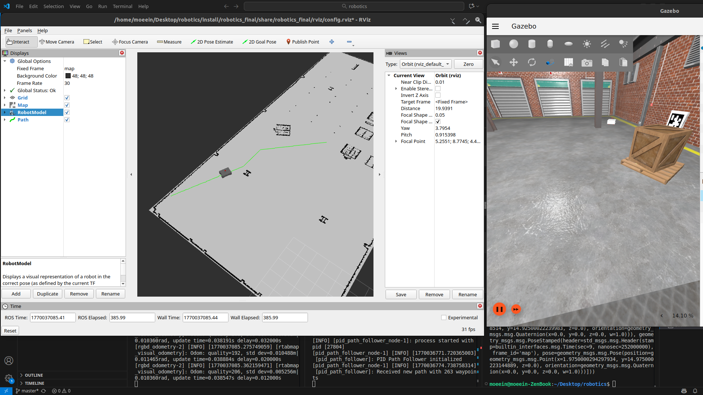

# امتحان نهایی درس رباتیک


1. مکان‌یابی (Localization) با AMCL
2. برنامه‌ریزی مسیر با A*
3. کنترل دنبال‌کردن مسیر با PID


## شروع سریع

در ابتدا پروژه را بیلد می‌کنیم:
```bash
colcon build
```

سپس سورس می‌کنیم:

```bash
source install/setup.bash
```

1) **اجرای شبیه‌سازی و مکان‌یابی**:

```bash
ros2 launch robotics_final localization.launch.py
```

2) **تعیین pose اولیه**


3) **بالا اوردن PID**

```bash
ros2 launch robotics_final pid_path_follower.launch.py linear_kp:=0.8 linear_kd:=0.15 angular_kp:=1.2 angular_kd:=0.15 lookahead_distance:=0.6 goal_tolerance:=0.15
```

3) **دنبال کردن مسیر**:

```bash
ros2 service call /plan_path robotics_final/srv/PlanPath "goal: {header: {frame_id: 'map'}, pose: {position: {x: 1.0, y: 1.0}}}"
```

---
---
---

## Q1: راه‌اندازی AMCL و مکان‌یابی (Localization)

### مرور کلی
در این پروژه برای مکان‌یابی ربات روی نقشهٔ معلوم از AMCL (Adaptive Monte Carlo Localization) استفاده شده است. AMCL یک روش احتمالاتی است که با Particle Filter تخمین pose ربات را در فریم `map` انجام می‌دهد.

### اجزای مکان‌یابی در `localization.launch.py`

فایل `localization.launch.py` کل پایپ‌لاین مکان‌یابی را بالا می‌آورد:

1. **Map Server**: بارگذاری و انتشار نقشهٔ occupancy grid
   - Reads map from `maps/depot.yaml`
   - Publishes map on `/map` topic
   - Uses lifecycle manager for proper initialization

2. **AMCL Node**: انجام مکان‌یابی احتمالاتی
   - Subscribes to `/scan` (laser scan) and odometry
   - Publishes robot pose estimate on `/amcl_pose`
   - Uses particle filter with configurable parameters
   - Configuration file: `config/amcl_config.yaml`

3. **نودهای کمکی**:
   - **Pointcloud to Laserscan**: Converts point cloud from depth camera to laser scan format for AMCL
   - **EKF Odometry**: Fuses IMU and wheel encoder data for odometry
   - **Frame ID Converter**: Handles coordinate frame transformations

### پارامترهای مهم تنظیمات

تنظیمات AMCL در `config/amcl_config.yaml` شامل موارد زیر است:
- **Particle Filter**: 500-2000 particles with KLD sampling
- **Laser Model**: Likelihood field model with 60 beams
- **Odometry Model**: Differential drive model with noise parameters
- **Frame IDs**: `base_link`, `odom`, `map`


# نتیجه اجرا




## Q2: پیاده‌سازی برنامه‌ریزی مسیر با A*

### مرور کلی
الگوریتم A* به‌صورت یک نود ROS 2 در فایل `astar_planner.cpp` پیاده‌سازی شده و سرویس برنامه‌ریزی مسیر ارائه می‌دهد.

### جزئیات الگوریتم

**ساختارهای داده**:
- **Node**: Represents a grid cell with position (x, y), g_cost (cost from start), f_cost (g_cost + heuristic), and parent pointer
- **Priority Queue**: Open set sorted by f_cost (lowest first)
- **Hash Map**: Tracks all visited nodes and their g_costs

**مراحل الگوریتم**:

1. **مقداردهی اولیه**:
   - Convert start and goal poses from world coordinates to grid coordinates
   - Create start node with g_cost=0 and f_cost=heuristic(start, goal)
   - Add start node to open set

2. **حلقه اصلی**:
   - Pop node with lowest f_cost from open set
   - If current node is goal, reconstruct path and return
   - For each neighbor (8-connected grid):
     - Calculate movement cost (1.0 for straight, √2 for diagonal)
     - Compute tentative g_cost = current.g_cost + movement_cost
     - If tentative g_cost < existing g_cost, update neighbor node
     - Set f_cost = g_cost + heuristic(neighbor, goal)
     - Add neighbor to open set

3. **بازسازی مسیر**:
   - Trace back from goal node to start using parent pointers
   - Convert grid coordinates back to world coordinates
   - Publish path as `nav_msgs/Path` on `/global_path` topic

**تابع heuristic**: فاصلهٔ اقلیدسی

**همسایه‌ها**: شبکهٔ ۸-اتصالی (با حرکت‌های قطری)

# نتیجه اجرا




## Q4: کنترل‌کننده PID برای دنبال‌کردن مسیر

### مرور کلی
کنترل‌کنندهٔ PID در `pid_path_follower.cpp` با توجه به خطای فاصله و خطای زاویه‌ای، فرمان‌های سرعت را تولید می‌کند تا مسیر برنامه‌ریزی‌شده را دنبال کند.

### استراتژی کنترل

1. **ردگیری مسیر (Path Tracking)**:
   - Finds closest waypoint on path to current robot position
   - Selects lookahead waypoint at `lookahead_distance` ahead
   - Computes distance error and angular error to lookahead point

2. **کنترل PID**:
   - **Linear PID**: Controls forward velocity based on distance to target
   - **Angular PID**: Controls rotation velocity based on angular error


### پارامترهای مهم

- **Linear PID Gains**: `linear_kp`, `linear_ki`, `linear_kd`
- **Angular PID Gains**: `angular_kp`, `angular_ki`, `angular_kd`
- **Lookahead Distance**: Distance ahead on path to target (default: 0.5m)
- **Goal Tolerance**: Distance threshold to consider goal reached (default: 0.2m)
- **Max Velocities**: `max_linear_vel` (default: 0.5 m/s), `max_angular_vel` (default: 1.0 rad/s)
- **Control Frequency**: Update rate (default: 20 Hz)

# نتیجه اجرا

نتیجه اجرا این سوال داخل `Q4-video.webm`
موجود است.

part1:


part2:



